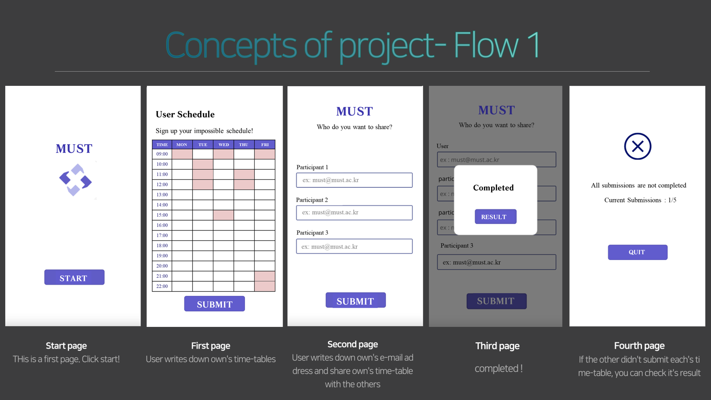
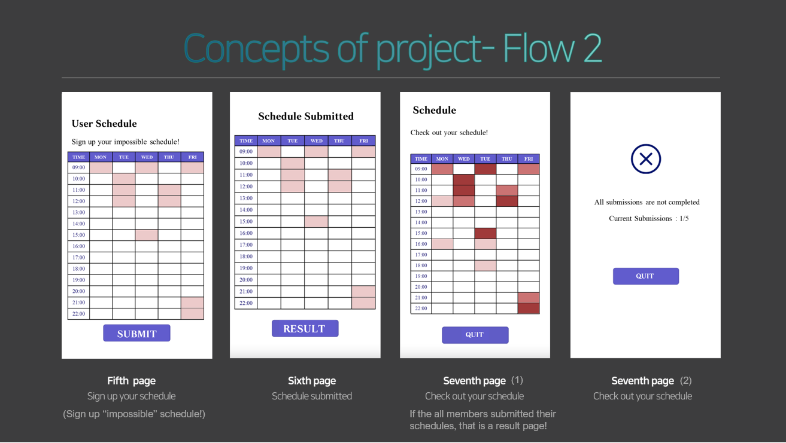

## 🟥🟩TEAM.10 MUST_MICROSOFT🟦🟨
 

### 1️⃣ What is 'MUST'?
>Platform for flexible scheduling.  
Choose the most relaxing time for your meeting people.

 

### 2️⃣ Please try our 'MUST'!
**🙋‍♀️ Schedule Organizer**
>***1. Login in Microsoft Teams with following account***  
    - URL : https://login.microsoftonline.com/common/oauth2/v2.0/authorize?response_type=id_token&scope=openid%20profile&client_id=5e3ce6c0-2b1f-4285-8d4b-75ee78787346&redirect_uri=https%3A%2F%2Fteams.microsoft.com%2Fgo&state=eyJpZCI6IjVmYmU0Y2ExLTM2ZDYtNDU1My1iMDEzLTJjNjc1MjcyNjllNCIsInRzIjoxNjYxMDQ4NzM5LCJtZXRob2QiOiJyZWRpcmVjdEludGVyYWN0aW9uIn0%3D&nonce=8eea9c8b-0165-469c-930f-46083e7c224f&client_info=1&x-client-SKU=MSAL.JS&x-client-Ver=1.3.4&client-request-id=1a67a6ce-866a-4c61-8b9c-93b5e2af0b55&response_mode=fragment  

> ***2. You can see three dots on the left side of your screen.***  
    - Click the three dots and you can see an application named MUST.  
    - Click the application and follow instructions below.  

> ***3. Now you can start to schedule with your meeting people.***  
    - First select the time you are not available and click submit button.  
    - You can check the time you selected after the submit.  

> ***4. Now insert teams email address for other meeting people.***  
    - All other participants will receive a teams message containing a url that will lead to selecting schedule page(which you just submitted).  

> ***5. You can now see result button.***  
    - If all the participants submitted their schedule, you can check the final schedule for your team.  
    - But if not, pending page appears and you have to wait until all the other members submit their schedule.   
    - When the final page is ready, it will show unavailable times for you and other participants.  
    - Most selected time will appear the darkest.  
    
 
 
 

**👥 For Participants**  
For the other people(except the one who sent the teams message)

> ***1. You have received a teams message containing a url.*** 
    - When you click the url, you can see the page where you have to select time you are not available.

> ***2. After you submitted your schedule, you can now see result button.*** 
    - If all the participants submitted their schedule, you can check the final schedule for your team.  
    - But if not, pending page appears and you have to wait until all the other members submit their schedule.  
    - When the final page is ready, it will show unavailable times for you and other participants.  
    - Most selected time will appear the darkest. 
 

 

## Thank you for trying our MUST ! 
